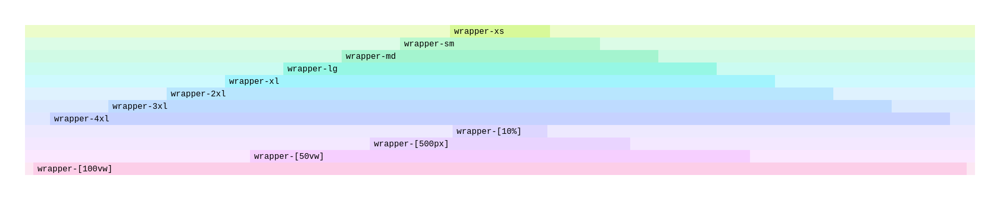

# Tailwind Wrapper

A Tailwind CSS v4 plugin that adds a wrapper that sets the width to a fixed size and centers the content inside it.

Supporting Tailwind V4.

## Installation

```bash
npm install tailwind-wrapper
```

## Installation

```css
@import "tailwindcss";
@plugin "tailwind-wrapper";
```

## Features

```html
<div class="font-mono">
    <div class="wrapper-xs bg-lime-100"><div class="px-2 bg-lime-200">wrapper-xs</div></div>
    <div class="wrapper-sm bg-green-100"><div class="px-2 bg-green-200">wrapper-sm</div></div>
    <div class="wrapper-md bg-emerald-100"><div class="px-2 bg-emerald-200">wrapper-md</div></div>
    <div class="wrapper-lg bg-teal-100"><div class="px-2 bg-teal-200">wrapper-lg</div></div>
    <div class="wrapper-xl bg-cyan-100"><div class="px-2 bg-cyan-200">wrapper-xl</div></div>
    <div class="wrapper-2xl bg-sky-100"><div class="px-2 bg-sky-200">wrapper-2xl</div></div>
    <div class="wrapper-3xl bg-blue-100"><div class="px-2 bg-blue-200">wrapper-3xl</div></div>
    <div class="wrapper-4xl bg-indigo-100"><div class="px-2 bg-indigo-200">wrapper-4xl</div></div>
    <div class="wrapper-[10%] bg-violet-100"><div class="px-2 bg-violet-200">wrapper-[10%]</div></div>
    <div class="wrapper-[500px] bg-purple-100"><div class="px-2 bg-purple-200">wrapper-[500px]</div></div>
    <div class="wrapper-[50vw] bg-fuchsia-100"><div class="px-2 bg-fuchsia-200">wrapper-[50vw]</div></div>
    <div class="wrapper-[100vw] bg-pink-100"><div class="px-2 bg-pink-200">wrapper-[100vw]</div></div>
</div>
```



## Development

1. Clone the repository
2. Install dependencies with `npm install`
3. Run development build with `npm run dev`
4. Check the example via `http://localhost:5173/`
5. Check the example in the `/example` folder

## Contributing

Contributions are welcome! Please feel free to submit a Pull Request.

## License

[MIT](LICENSE)
